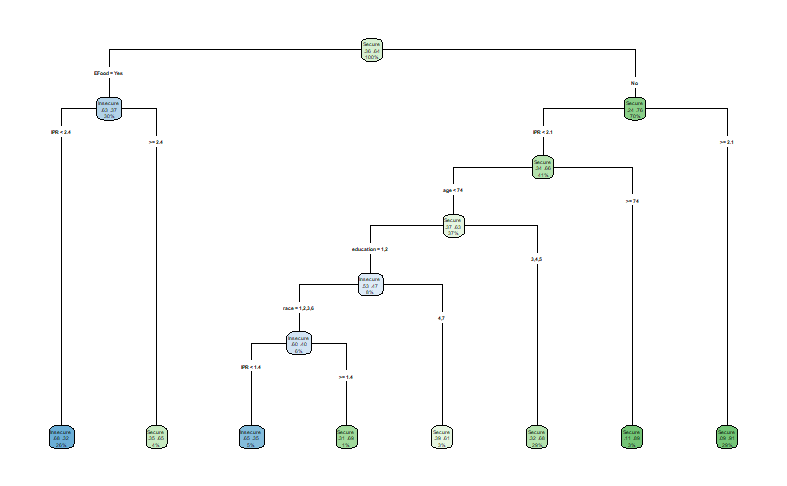

[Final project code](final-project-code.html)

## Introduction
  NHANES, the National Health and Nutrition Examination Survey, is a survey conducted by the CDC's National Center for Health Statistics, NCHS, annually. This survey collects information from about 5000 adults and children across the country every year, since 1999. As there are records prior, however continuous data collection has not stopped since 1999.Data published from NHANES is publicly available, minus any potentially identifiable information pertaining the participants. 
  In our research we wanted to focus on the most recent year that data is available for, and we have decided to use the 2021-2023 data set. This is due to NCHS being unable to provide the complete 2025 data set. Due to the extensive amounts of data, we decided to spread our research questions across different topics. In this project we delve into the associations with BMI, predicting if adult obesity, association between alcohol consumption and high blood pressure, and predicting the food security of a household. 
  
# Method
  Our initial step is to import the "Haven" library, and the other libraries needed for our testing, in order to import and read the .xpt files obtained from the NHANES website.
```{r}
library(haven)
```
  
## How are age, gender, race/ethnicity, physical activity, and smoking associated with BMI?

To answer this question, we will use linear regression analysis and begin with a short overview of the regression process. The goal of using linear regression is to assess weather the relationships that we observe in a sample are likely to exist in the larger population. The regression analysis computes a t-statistic for each independent coefficient and turns that into a p-value. The p-value which is associated with each independent variable test the null hypothesis that the corresponding coefficients is equal to zero, indicating that no linear relationship with the dependent variable exists. Failing to reject the null suggests that insufficient evidence of an association between the independent variable and the response exist, however this is not support of the null hypothesis.

We start by downloading NHANES data for the 2021 - 2023 cohort from the CDC website [cdc.gov](https://wwwn.cdc.gov/nchs/nhanes/search/datapage.aspx?Component=Questionnaire&Cycle=2021-2023). We used a subset of the available data set which includeed: `Alcohol`, `Body measurements`, `Blood Pressure & Cholesterol`, `Demographics data`, `Income information`, `Smoke usage`, and `Physical activity` (both youth and adults). These files are available to the public in `.xpt` format, and after downloading, they were loaded into a data frame in R using the `read_xpt` function. Since each data file contains a unique `Respondent Sequnece Number` we are able to join all of the individual files then combined into one full data frame. This total data frame is then filtered to include only the necessary variables and drop any missing values. We then fit a linear regression model using BMI as a predictor and age, gender, physical activity, and smoking as independent variables. We are left with 1847 observations to work with for a linear regression model; viewing a plot of the results we can see that a strong relation ship is not present. 

## Checking for significance in the model

After fitting the linear regression model, looking at the coefficients output from the `summary(model)` command. A coefficient value of `Pr(>|t|) > 0.05` should be treated as not statistically significant at the standard 95% confidence level given the other predictors in the model.

We can see from the coefficient table that some of the variables are not significant and do not contribute to the linear model.
```{r}
#| echo: false
#| message: false
#| warning: false
#| include: false
#| paged-print: false

library(haven)
library(tidyverse)
# Data is from: https://wwwn.cdc.gov/nchs/nhanes/continuousnhanes/default.aspx?Cycle=2021-2023
# Description of data: https://wwwn.cdc.gov/nchs/nhanes/search/datapage.aspx?Component=Questionnaire&Cycle=2021-2023

# Load data
data_alq = read_xpt("./data/ALQ_L.xpt")     # Alcohol
data_bmx = read_xpt("./data/BMX_L.xpt")     # Body measurements
data_bpq = read_xpt("./data/BPQ_L.xpt")     # Blood Pressure & Cholesterol
data_demo = read_xpt("./data/DEMO_L.xpt")   # Demographics data
data_fsq = read_xpt("./data/FSQ_L.xpt")   # Not related to health demographics and not used.
data_inq = read_xpt("./data/INQ_L.xpt")     # Income information
data_paq = read_xpt("./data/PAQ_L.xpt")     # Physical activity adult
data_paqy = read_xpt("./data/PAQY_L.xpt")   # Physical activity youth
data_smq = read_xpt("./data/SMQ_L.xpt")     # Smoke usage
data_smqr = read_xpt("./data/SMQRTU_L.xpt") # Smoking recent


# Join the data into a single df
data_total = left_join(data_alq, data_bmx)
data_total = left_join(data_total, data_bpq)
data_total = left_join(data_total, data_demo)
# data_total = left_join(data_total, data_fsq) # Not used for initial regression fit
data_total = left_join(data_total, data_inq)
data_total = left_join(data_total, data_paq)
data_total = left_join(data_total, data_paqy)
data_total = left_join(data_total, data_smq)
data_total = left_join(data_total, data_smqr)


# Linear regression: BMI ~ age + gender + physical activity + smoking

model_df = data_total %>%
  transmute(
    BMI = BMXBMI,
    age = RIDAGEYR,
    gender = RIAGENDR,
    days_physical = PAD800,
    smoking = SMQ040
  ) %>%
  # Remove special missing/refused codes
  filter(
    !is.na(BMI),
    !is.na(age),
    !is.na(gender),
    !is.na(days_physical),
    !is.na(smoking),
    !days_physical %in% c(7777, 9999), # NHANES codes: 7777-Refused, 9999-Don't know
    smoking %in% c(1, 2, 3)  # NHANES codes: 1-Every day, 2-Some days, 3-Not at all
  ) %>%
  mutate(
    gender = factor(gender, levels = c(1, 2),
                          labels = c("Male", "Female")),
    smoking = factor(smoking, levels = c(1, 2, 3),
                     labels = c("Every day", "Some days", "Not at all"))
    )

# Set "Not at all" as the reference level used in lm() output
model_df$smoking = relevel(model_df$smoking, ref = "Not at all")

# Fit model
fit_bmi = lm(BMI ~ age + gender + days_physical + smoking, data = model_df)

# Results
summary(fit_bmi)

# Visual diagnostics plot
par(mfrow = c(2, 2)) # divide the plotting area into 2x2 grid
plot(fit_bmi)


# Table of coefficients
coef_table = summary(fit_bmi)$coefficients
coef_table

# Non significant coefficients
nonsig = coef_table[coef_table[, "Pr(>|t|)"] > 0.05, , drop = FALSE]
nonsig

```

### Table of all coefficients
```{r}
#| echo: false
#| message: false
#| warning: false
#| paged-print: false
coef_table
```


### Table of nonsignificant coefficients
```{r}
#| echo: false
#| message: false
#| warning: false
#| paged-print: false
nonsig
```


**Analysis from the `final_fit` model:**   
We can see that at least one predictor is associated with BMI meaning that overall the model is statistically significant. However; the R^2 value of 0.0179 and adjusted R^2 fo 0.0158 means that these variables only explain less than 1.8% of the total BMI variation. 

Age is significant and negative (beta = -.0365, p = 0.00019), this means that holding all other variables fixed, each 1 year increase in age is associated with about 0.036 lower BMI on average.

Days of physical activity is not significant, p = 0.116, we see no strong evidence that it contributes after adjustment in the model. 

Smoking Some Days" shows a borderline significance with p = 0.0577, this shows weak evidence for higher BMI than the referenced smoking group.

"Smoking Every Day" is significant and positive, beta = 1.714 and p < 0.001, this category has about a 1.71 higher BMI than the referenced smoking category adjusting for age and physical activity.

### Results (summary of the model fit)
```{r}
#| echo: false
#| message: false
#| warning: false
#| paged-print: false
summary(fit_bmi)
```

## Interpretation:
Holding all other variables constant:
  - Age: Every year of additional age shows a decrease of 3% in BMI.  
  - Gender: Females have on average 1.48% higher BMI than males.  
  - Activity: Surprisingly the `days phycially active` is not statistically significant, no clear evidence that the reported days of physical activity relates to BMI.  
  - Smoking: Daily smokers have on average 1.68% lower BMI while `smokingSome days` is not significant.  

The `RSE` of 6.594 is quite large meaning that the predictions are noisy; the only predictors that actually show statistical significance are `Age`, `Gender`, and `Daily Smoking` but the effect sizes are small relative to noise. The low `Multiple R-squared` value suggests that the model is missing key predictors like diet, income, and sedentary behavior like screen time or office work.


**Overall Summary of Findings**
We fit a multiple linear regression model to examine the association between body mass index (BMI) and age, gender, days of physical activity, and smoking. The overall model is statistically significant with an p-value of 8.4 * 10^-11 but it explains vary little of the variation in BMI. The `Multiple R-squared:  0.0299` and    `Adjusted R-squared:  0.02727 ` mean that the model explains less than 3% of the variability in BMI. Though some coefficients are statistically significant, the model has limited explanatory power, it finds real but weak relationships and is not useful for accurate predictions. This suggests that important BMI predictors are not included.


### Visual diagnostics plot
```{r}
#| echo: false
#| message: false
#| warning: false
#| paged-print: false
par(mfrow = c(2, 2)) # divide the plotting area into 2x2 grid
plot(fit_bmi)
```


## Using variable selection
For the next analysis we will use subset selection. This method involves identifying a subset of predictors that we believe to be related to the response variable, BMI, then using only the reduced set of variables to fit the model. In cases of higher deminsion, where the number of parameters outnumber the number of samples, it is necessary to redice the number of variables and using subset selection is an important method used to address this problem.

We use best subset selection using `regsubsets` from the [leaps package](https://cran.r-project.org/web/packages/leaps/leaps.pdf) to compare every possible combination of predictors for explaining BMI from age, gender, days of physical activity, and smoking. Since we only have 4 predictors, we used the "exhaustive search" which fits all subset models from the empty set up to teh full set; this method would not be used for a vary large number of predictors (more than around 30) due to the computational resources required. 

We then pick the subset size that maximizes the adjusted R^2, minimizes Cp and BIC. 

```{r q1 subset selection}
#| echo: false
#| message: false
#| warning: false
#| include: false
#| paged-print: false

# install.packages("leaps")  # run once
library(leaps)

# Build matrix from same formula
x = model.matrix(BMI ~ age + gender + days_physical + smoking, data = model_df)[, -1]
y = model_df$BMI

subset_fit = regsubsets(x = x, y = y, nvmax = ncol(x), method = "exhaustive")
subset_sum = summary(subset_fit)

# Summary
subset_sum
```


## Best model size by each criterion
```{r}
#| echo: false
#| message: false
#| warning: false
#| include: false
#| paged-print: false
best_adjr2_size = which.max(subset_sum$adjr2) # identify the location of the maximum Adj. R_sq
best_cp_size    = which.min(subset_sum$cp)    # identify the location of the minimum Cp
best_bic_size   = which.min(subset_sum$bic)   # identify the location of the minimum BIC

# Coefficients for best BIC, cp, adjR^2 model, print the estimated coefficients for the best model of size k
coef(subset_fit, best_adjr2_size)
coef(subset_fit, best_cp_size)
coef(subset_fit, best_bic_size)
```


## Summary of the fit with selected terms
```{r}
#| echo: false
#| message: false
#| warning: false
#| paged-print: false
final_fit = lm(BMI ~ age + days_physical + smoking, data = model_df)
summary(final_fit)
```

We used the subset selection to determine that age, physical activity, and smoking to be the best variables. The overall fit for the model was statistically significant indicating that taken together, the predictors provide a better fit than the intercept only model. However again we see the same issue with this model, the `Adjusted R-squared:  0.01577` means that less than 1.6% -1.8% of the variation in BMI is explained. The RSE of 6.63 and relativly low R^2 indicate that most of the variation in BMI remains unexplained by age, physical activity, and smoking alone.


## Plot RSS, adjusted R^2, Cp, and BIC for all of the models at once
```{r}
#| echo: false
#| message: false
#| warning: false
#| paged-print: false
par(mfrow = c(2, 2)) # divide the plotting area into 2x2 grid
plot(final_fit)
```

```{r}
#| echo: false
#| message: false
#| warning: false
#| paged-print: false

# divide the plotting area into 2x2 grid
par(mfrow = c(2, 2))
plot(subset_sum$rss, xlab="Number of Variables ", ylab = "RSS", type = "l")
points(which.min(subset_sum$rss),min(subset_sum$rss), col="red", cex=2, pch=20)

plot(subset_sum$adjr2, xlab = "Number of Variables ", ylab = "Adjusted RSq", type = "l")
points(best_adjr2_size, max(best_adjr2_size), col="red", cex=2, pch=20)

plot(subset_sum$cp, xlab = "Number of Variables ", ylab = "Cp", type = "l")
points(best_cp_size, best_cp_size, col="red", cex=2, pch=20)

plot(subset_sum$bic, xlab = "Number of Variables ", ylab = "BIC ", type = "l")
points(best_bic_size, best_bic_size, col="red", cex=2, pch=20)

```

From the images above we can see that the model with the lowest RSS uses all 5 variables, while the Cp and BIC models each show that the model with 3 variables preforms best.


## Can we use Principal Component Analysis (PCA) to predict adult obesity 

Principal Component Analysis is a linear dimension reduction method that reduces a set of possibly correlated variables with a smaller set of uncorrelated principal components that retain as much variance as possible. It is used to simplify high-dimensional data, reduce noise, handle multicollinearity, and is especially useful when many variables are strongly correlated because it compresses the data into fewer variables without changing the underlying linear structure.

In this section we begin by defining obesity as an adult with (BMI >= 30) and an adult as anyone over the age of 20 years old. We then set up PCA and logistic regression in order to identify weather a relationship exists between lifestyle and BMI. We build a dataframe with age, sex, race/ethnicity, days of physical activity, smoking, and BMI from the complete data frame (from part 1). Next, keep adults over the age of 20, drop incomplete rows and invalid survey codes. This and the definition of obesity as an adult with BMI >= 30, will be the foundation for the analysis.

In R the [`prcomp` function](https://www.rdocumentation.org/packages/stats/versions/3.6.2/topics/prcomp) is used to preform a principal components analysis on the given data matrix and returns the results as an object of class `prcomp`.


```{r, q2}
#| echo: false
#| message: false
#| warning: false
#| include: false
#| paged-print: false

# Predict adult obesity (BMI >= 30) from demographics + lifestyle using PCA + logistic regression.

pca_obesity_df = data_total %>%
  transmute(
    BMI = BMXBMI,
    age = RIDAGEYR,
    gender = RIAGENDR,
    race_eth = RIDRETH3,
    days_physical = PAD800,
    smoking = SMQ040
  ) %>%
  filter(
    age >= 20,
    !is.na(BMI),
    !is.na(age),
    !is.na(gender),
    !is.na(race_eth),
    !is.na(days_physical),
    !is.na(smoking),
    !days_physical %in% c(7777, 9999),
    smoking %in% c(1, 2, 3)
  ) %>%
  mutate(
    gender = factor(gender, levels = c(1, 2),
                    labels = c("Male", "Female")),
    smoking = factor(smoking, levels = c(1, 2, 3),
                     labels = c("Every day", "Some days", "Not at all")),
    smoking = relevel(smoking, ref = "Not at all"),
    race_eth = droplevels(factor(race_eth)),
    obese = factor(
      BMI >= 30,
      levels = c(FALSE, TRUE),
      labels = c("Not obese", "Obese")
    )
  )

# Build matrix from same formula
X_obesity = model.matrix(
  ~ age + gender + race_eth + days_physical + smoking,
  data = pca_obesity_df)[, -1, drop = FALSE]

pca_obesity = prcomp(X_obesity, center = TRUE, scale. = TRUE)

imp = summary(pca_obesity)$importance
imp[, seq_len(min(8L, ncol(imp))), drop = FALSE]

# Scree plot: proportion of variance per PC (for choosing how many PCs matter)
n_pc_obesity = ncol(pca_obesity$x)
scree_obesity_df = tibble(
  pc = seq_len(n_pc_obesity),
  proportion_variance = as.numeric(
    imp["Proportion of Variance", seq_len(n_pc_obesity), drop = TRUE]
  )
)
p_obesity_scree = ggplot(scree_obesity_df, aes(pc, proportion_variance)) +
  geom_col(width = 0.65, fill = "steelblue", alpha = 0.85) +
  geom_line(aes(group = 1), color = "#c0392b", linewidth = 0.6) +
  geom_point(color = "#c0392b", size = 2.2) +
  scale_x_continuous(breaks = scree_obesity_df$pc) +
  scale_y_continuous(labels = scales::label_percent(accuracy = 0.1)) +
  labs(
    title = "Scree plot: demographic and lifestyle predictors",
    subtitle = "BMI is not entered into PCA; components summarize age, sex, race, activity, smoking",
    x = "Principal component",
    y = "Proportion of variance"
  ) +
  theme_minimal()

# Use enough PCs for glm (cap at 4); PCA is unsupervised so we keep k modest.
k_pc = min(4L, ncol(pca_obesity$x))

pc_ob_df = as_tibble(pca_obesity$x[, seq_len(k_pc), drop = FALSE]) %>%
  mutate(obese = pca_obesity_df$obese)

pve1 = round(100 * imp["Proportion of Variance", "PC1"], 1)
pve2 = round(100 * imp["Proportion of Variance", "PC2"], 1)

p_obesity_pca = ggplot(pc_ob_df, aes(PC1, PC2, color = obese)) +
  geom_point(alpha = 0.35, size = 1.5) +
  labs(
    title = "PCA of demographic and lifestyle predictors (adults 20+)",
    subtitle = "Colored by obesity (BMI >= 30); BMI excluded from PCA",
    x = sprintf("PC1 (%s%% variance)", pve1),
    y = sprintf("PC2 (%s%% variance)", pve2),
    color = NULL
  ) +
  theme_minimal()

# Logistic regression on leading PCs (supervised step after unsupervised PCA)
pc_terms = paste0("PC", seq_len(min(4L, k_pc)))
obesity_glm_form = as.formula(paste("obese ~", paste(pc_terms, collapse = " + ")))
obesity_glm = glm(obesity_glm_form, family = binomial(), data = pc_ob_df)
summary(obesity_glm)

pc_ob_df = pc_ob_df %>%
  mutate(
    p_hat = predict(obesity_glm, type = "response"),
    pred_class = factor(
      ifelse(p_hat >= 0.5, "Obese", "Not obese"),
      levels = c("Not obese", "Obese")
    )
  )

table(observed = pc_ob_df$obese, predicted = pc_ob_df$pred_class)
mean(pc_ob_df$pred_class == pc_ob_df$obese)

# Variables most aligned with PC1 (absolute loadings)
load1 = sort(abs(pca_obesity$rotation[, "PC1"]), decreasing = TRUE)
head(load1, 10)

```

```{r q2-figs}
#| echo: false
#| message: false
#| warning: false
#| fig-subcap:
#|   - "Scree plot: share of total variance per principal component."
#|   - "Scores on PC1 and PC2, colored by obesity (BMI $\\geq$ 30)."
#| layout-ncol: 1
#| fig-width: 7
#| fig-height: 4

p_obesity_scree
p_obesity_pca
```

**PCA analysis** We build an analysis sample of adults 20 years and older with complete BMI, demographics, days of physical activity, and smoking (excluding invalid survey codes), and defines obesity as BMI at or above 30. Predictors are turned into a numeric design matrix via `model.matrix` (dummy coding for factors), then PCA is run on that matrix with centering and scaling so each variable contributes on a comparable scale. **BMI is not in the PCA**; it only labels points and defines the outcome for the supervised step. The **scree plot** shows how much variance each principal component explains, which helps judge how many dimensions carry most of the signal (often interpreted together with an “elbow,” though here the later logistic model caps at four PCs for parsimony). The scatter of PC1 vs PC2 is exploratory separation of obese vs not obese in the reduced predictor space. **Logistic regression** then uses the leading principal component scores (up to four) as predictors of obesity, yielding predicted probabilities, a simple 0.5 threshold classifier, and a confusion table; **loadings** on PC1 indicate which original predictors align most strongly with the first component.


## Is alcohol use (ALQ_L) associated with high blood pressure (BPQ_L — "ever told you had high blood pressure")?

  As noted earlier, NHANES survey collects a large amount of data, with topics ranging from physical activity to most common types of diseases. 
  For this question, we decided to see if we could predict an association between alcohol use and high blood pressure diagnostic. To do this, we pulled the following columns from the ALQ_L.xpt file, ALQ111, "ever had a drink of alcohol", ALQ130, the frequency at which the individual drank. The levels factored for drinking frequency varied from "Non-drinker", "Light", "Moderate", and "High".  We then pulled the following column from the BPQ_L.xpt file, BPQ080, "have you ever been told you had high blood pressure". Finally, we joined the two data sets by inner joining by the individuals' sequence number and filtered it to anyone 18 years or older, as we are looking into alcohol consumption. 
  
  
  After compiling the data needed for this testing, we decided that using the chi square test of independence would fit best since we are working with two categorical variables. Through this testing, we will be able to determine whether the two variables, alcohol consumption and high blood pressure, are associated with each other. Now that the data has been gathered, we enter the two columns into a contingency table and run the chi square test.
```{r}
#| message: false
#| warning: false
#| include: false
#| paged-print: false
library(haven)
library(tidyverse)
library(gmodels)
library(corrplot)

data_alq = read_xpt("./data/ALQ_L.xpt")     # Alcohol
data_bmx = read_xpt("./data/BMX_L.xpt")     # Body measurements
data_bpq = read_xpt("./data/BPQ_L.xpt")     # Blood Pressure & Cholesterol
data_demo = read_xpt("./data/DEMO_L.xpt")   # Demographics data
data_fsq = read_xpt("./data/FSQ_L.xpt")     #Food security 
data_inq = read_xpt("./data/INQ_L.xpt")     # Income information
data_paq = read_xpt("./data/PAQ_L.xpt")     # Physical activity adult
data_paqy = read_xpt("./data/PAQY_L.xpt")   # Physical activity youth
data_smq = read_xpt("./data/SMQ_L.xpt")     # Smoke usage
data_smqr = read_xpt("./data/SMQRTU_L.xpt") # Smoking recent
cst = data_demo %>%      #creating the dataframe for the chi square goodness of fit test
  inner_join(data_alq, by = "SEQN") %>%
  inner_join(data_bpq, by = "SEQN") %>%
  filter(RIDAGEYR >= 18)

cst$ALQ111[is.na(cst$ALQ111)] = 0 # replacing na values with 0 to fit testing
cst$ALQ130[is.na(cst$ALQ130)] = 0


cst["HighBP"]= c( " ")  #creating column space for high blood pressure
cst["Drinks"]= c( " ")  #column for amount of drinks had per day


cst_clean = cst%>% mutate(cst, Drinks = if_else(ALQ111 == 2, "Non-drinker",
                                         if_else(ALQ111 ==1 & ALQ130 <=2,"Light",
                                                 if_else(ALQ111 == 1 & ALQ130 <= 4, "Moderate",
                                                         if_else(ALQ111 ==1 & ALQ130 > 4, "High",
                                                                 if_else(ALQ111 == 9, NA,
                                                                         if_else(ALQ111 == ".", NA, 
                                                                                 if_else(ALQ111==1 & ALQ130 ==777, NA,
                                                                                         if_else(ALQ111==1 & ALQ130 ==999, NA,
                                                                                                 if_else(ALQ111==1 & ALQ130 == ".",NA,"Non-drinker"))))))))),
                     HighBP = if_else(BPQ080 == 1, "Yes", "No"),

      HighBP  = factor(HighBP,  levels = c("No", "Yes")),
      Drinks   = factor(Drinks,
                       levels = c("Non-drinker", "Light",
                                  "Moderate", "High")))

cst_clean= cst_clean[!is.na(cst_clean$Drinks),]

test_data = cst_clean %>% select(HighBP, Drinks)
contingency_table = table(test_data$HighBP, test_data$Drinks)
print(contingency_table)

chisq_res = chisq.test(contingency_table)  # test of independence
chisq_res
chisq_res$expected
print(round(chisq_res$expected,2))
print(round(chisq_res$residuals, 2)) 

corrplot(chisq_res$residuals, is.cor = FALSE)


```
# Contingency Table and Chi Sqaure Results
```{r}
#| echo: false
#| message: false
#| warning: false
#| paged-print: false
print(contingency_table)
```

```{r}
#| echo: false
#| message: false
#| warning: false
#| paged-print: false
chisq_res
```
  
  
   When comparing the chi square "expected" results, it is important to remember that the values shown is what the expected observations would be if the two variables were independent of each other. When looking at the values of the chi square "residuals", or Pearson Residuals, if the absolute value of a cell is greater than three, it would indicate whether or not that cell contributed to a significant lack of fit. This would mean for a high positive residual the cell contains a much higher count than expected, and the opposite for high negative residuals. Knowing this, we see that the absolute value of both "Yes" and "No" for the "Light" drinking frequency could both contribute to a significant lack of fit.
```{r}
#| echo: false
#| message: false
#| warning: false
#| paged-print: false
print(round(chisq_res$expected,2))
```

   
  However, a significant lack of fit driven by on or more cells in a test of independence suggests that an association does in fact exist. This is not to say alcohol directly causes high blood pressure, but we can conclude, after rejecting the null hypothesis, that alcohol consumption and high blood pressure are associated. If we wanted to test how strong of a variable alcohol consumption was, we would need to do further research and testing in the future.
  
  
  Additionally, we were able to plot the residuals from our expected values against the observed ones, and we noted that the absolute value of all the standardized residuals were greater than 2. This also leads us to the same conclusion where both variables can be noted as statistically significant.
```{r}
#| echo: false
#| message: false
#| warning: false
#| paged-print: false
corrplot(chisq_res$residuals, is.cor = FALSE)

```
```{r}
#| echo: false
#| message: false
#| warning: false
print(round(chisq_res$residuals, 2)) 
```
  
  We reject the null hypothesis since the p-value, 7.315e-14 is much smaller than the significance levels. This provides strong evidence of a significant association between the person's blood pressure  and the amount of drinks consumed. In other words, the chi-square test results indicate that the likelihood of an adult having high blood pressure is significantly associated with the amount of drinks consumed.
  
  


## Can we predict whether a household will be Food Secure or Inseucre based on based on SNAP participation, WIC receipt, emergency food use, and demographic characteristics?
 
  For this question we acquired FSQ_L.xpt and Demo_L.xpt files from the NHANES data directory, and used the following columns; from FSQ_L.xpt we selected FSDAD, "adult food security category, FSQ012, whether or not the person's household received SNAP or Food Stamp benefits in the last 12 months, FSD151, whether or not the household received emergency food, including food from a church, food pantry, food bank, or soup kitchen, FSD162, if the household received Women, Infants, and Children program benefits in the last 12 months, and FSD165N, how many people in a household received SNAP or food stamps benefits.


  Within the NHANES survey, there are options like "refused", "don't know", or "missing", so we decided to replace any values like those with N/A and omitted those rows from the compiled data set. From the demographic data set, Demo_L.xpt, we pulled the columns containing the age, race, sex, education level, income to poverty ration, and household size. 
  
  
  After compiling the data needed for this testing, we decided that forming a classification tree would fit best since we wanted to find an outcome based on the categorization of the individuals, and not a continuous result. Now that the data has been compiled by individuals' sequence number, we factor the levels to be yes or no for the majority of our variables, and label insecure or secure based on the FSDAD column. 
  
  We used a 70%/30% training/testing split since we had a large data set, and would afford us a more rigorous training set to work off of. After background research on the rpart package, we examined the complexity parameter table, and found the tree that would use the lowest cross validated error (xerror) and the amount of splits correlated to it. Using "which.min()", we were able to prune our tree and prevent over fitting our model. 
```{r}
#| message: false
#| warning: false
#| include: false
#| paged-print: false
#Q4 - Can we predict whether an individual or household is food secure or insecure based on the following variables

library(haven)       
library(tidyverse)
library(caret)       
library(rpart)       
library(rpart.plot)
data_fsq = read_xpt("./data/FSQ_L.xpt")

data_fsq$FSDAD[is.na(data_fsq$FSDAD)] = 0

data_fsq["Food_insecure"]=c(" ") #column that says whether or not the individual is classified as food insecure or not
data_fsq["On_Snap"]=c(" ")  #column that says whether or not they were receiving SNAP benefits in the last 12 months
data_fsq["EFood"]= c(" ")  #column that says whether or not they received emergency food
data_fsq["WIC"]=c(" ")   #column that says whether or not the household received WIC program benefits
data_fsq["NSnap"]= c(" ") #column that says the amount of people in a household received SNAP benefits

# adding N/A as a value to clean later on
fsq_test = data_fsq %>% mutate(data_fsq, Food_insecure= if_else(FSDAD>=3,1, #1 = yes, 2= no
                                                      if_else(FSDAD>0 & FSDAD <3, 2,
                                                              if_else(FSDAD == ".", NA, 2))),
                          On_Snap = if_else(FSQ012>2, NA,
                                                  if_else(FSQ012 == ".",NA, FSQ012)),
                  EFood = if_else(FSD151>2, NA,
                                        if_else(FSD151 == ".",NA,FSD151)),
                  WIC = if_else(FSD162>2, NA,
                                if_else(FSD162== ".", NA, FSD162)),
                  NSnap =if_else(FSD165N>7, NA,
                                 if_else(FSD165N==".",NA,FSD165N)))


demo_test = data_demo %>%
  select(SEQN, age=  RIDAGEYR, sex = RIAGENDR, race = RIDRETH3, education = DMDEDUC2, IPR = INDFMPIR, hh_size = DMDHHSIZ)

test_data2 = fsq_test %>%
    inner_join(demo_test, by = "SEQN") %>%
        select(Food_insecure,On_Snap,EFood,WIC,NSnap,age, sex, race, education, IPR, hh_size)

test_data2 = test_data2 %>% mutate(
                    Food_insecure = factor(Food_insecure, levels = c(1,2), labels = c("Insecure","Secure")),
                    sex = factor(sex, levels = c(1,2), labels = c("Male","Female")),
                    race = factor(race),
                    education = factor(education),
                    On_Snap = factor(On_Snap, levels = c(1,2), labels = c("Yes","No")),
                    EFood= factor(EFood,levels = c(1,2), labels=c("Yes","No")),
                    WIC = factor(WIC,levels = c(1,2), labels = c("Yes","No"))) 
test_data2 = test_data2 %>% na.omit(test_data2)

set.seed(1)


trainsize = floor(0.70 * nrow(test_data2))
indices = sample(seq_len(nrow(test_data2)), size = trainsize)
tdata = test_data2[-indices,]
trdata = test_data2[indices,]

#prop.table(table(trdata$Food_insecure))

FoodTree = rpart(Food_insecure~ On_Snap + EFood+ WIC + IPR + hh_size + age + sex + race + education,
                 trdata, method = "class", na.action = na.rpart, control = rpart.control(
                   cp = 0.005,
                   minsplit = 20,
                   maxdepth = 6
                 ))

#printcp(FoodTree)
bestv = FoodTree$cptable[which.min(FoodTree$cptable[, "xerror"]),"CP"]
prunetree = prune(FoodTree,cp=bestv)
rpart.plot(prunetree,
           type = 4,
           extra = 104,
           fallen.leaves = TRUE)

```
```{r, out.width = "120%"}
#| echo: false
#| message: false
#| warning: false
#| paged-print: false


```
  
  From our model and examining the "variable.importance", we are able to tell that Emergency food is the first split due its high impact on predicting an individuals' food security. 
```{r}
#| echo: false
#| message: false
#| warning: false
#| paged-print: false
prunetree$variable.importance
```

  
  Checking the confusion matrix, we can see that we had a 70.88% accuracy of people being classified correctly. However our true positive and negative rates were 46.93% and 84.65%, meaning that only 46.93% of all food insecure people were correctly classified as food insecure and 84.65% of food secure people were classified correctly. Since we have a high specificity and low sensitivity, we can assume that our model is good at dictating when someone is food secure, however it has issues like false negatives when classifying someone as food insecure.
```{r}
#| echo: false
#| message: false
#| warning: false
#| paged-print: false

tree_class = predict(prunetree, tdata, type="class")
treeprob = predict(prunetree, tdata, type = "prob")[, "Insecure"]
cm = confusionMatrix(tree_class, tdata$Food_insecure, positive = "Insecure")
FN = cm$table[2,1]  
TP = cm$table[1,1]    
FNR = FN / (FN + TP)

cm
```
```{r}
#| echo: false
#| message: false
#| warning: false
#| paged-print: false
FNR =round ((FN / (FN + TP))*100, digits = 2)
cat("The False Negative rate is ",FNR,"%.")

```


  When checking the predicted values, we can see that 63.73% of the people the model predicted as food insecure were correct, and 73.51% of the people predicted as food secure were correct. Additionally we are able to check our false negative rate, and we resulted with a 53.07% rate. This indicates that our model missed out on about 147 households, who were classified as secure. We can conclude that our model is able to predict the food security of individuals, however the results should be investigated more due to the large amount of households that were excluded in the final results.

  

# Conclusion

In summary, according to our analysis and testing of the data by linear regression models, we find it dificult to find a model that explains the variation in BMI as well as the significant association between alcohol consumption and high blood pressure, and the reliability of our classification tree. 

